# 结合使用混合云和 IBM Z 实现银行业数字化。

下面这个教程将通过一个名为 MPLbank 的模拟零售银行，介绍 IBM Bluemix 上发布的银行 API 和在 IBM Z 大型机上运行的逻辑业务程序。

# MPLbank

## 架构

本教程将访问一个名为 MPLbank 的虚构零售银行系统。MPLbank 集成了一个帐户管理系统、一个支付中心（图解中未显示）、一个客户管理系统和一个金融风险管理系统。基于这些组件，我们设置了一个托管在 IBM Bluemix 中的 API 层来提供一个银行 API，并使各种各样的应用程序能够访问它。

2.	[订阅银行 API](#2-subscribe-to-the-banking-api)
3.	[使用银行 API](#3-work-with-the-banking-api)

### 部分 B：创建您自己的银行应用程序

1.	[下载并检查银行应用程序代码](#1-download-and-review-the-banking-application-code)
2.	[运行银行应用程序](#2-run-the-banking-application)

### 部分 C：将银行应用程序扩展到 Bluemix 中

1. 	[开始使用 Node.js on Bluemix](#1-start-with-nodejs-on-bluemix)
2.	[使用 Watson 服务创建一个认知应用程序](#2-make-a-cognitive-application-using-watson-services)

### EXTRA : 开始结合使用物联网和银行 API
---

# 部分 A：发现并测试银行 API

## 1.首先访问 API 开发者门户 
1.	如果没有 [IBM ID]，请注册一个。

2.	访问 [API 开发者门户]。

3.如果没有帐户，请创建一个。
	
   * 单击 **Create an Account**.
   * 提供所有需要的信息。确保为此帐户使用您的 IBM ID（电子邮箱地址）。
   * 单击 **Submit**。

  
   将向您注册的 IBM ID 电子邮箱发送一封帐户激活邮件。单击此邮件中的链接激活您的帐户。

4.登录到您的帐户。

5.创建一个新应用程序。
	
	* 单击菜单中的 **Apps**。
	* 单击 **Create new App**。
	* 填写所有需要的字段。
	* 单击 **Submit**。
	
	记下 *client ID* 和 *client Secret*。稍后访问该 API 时需要它们。
	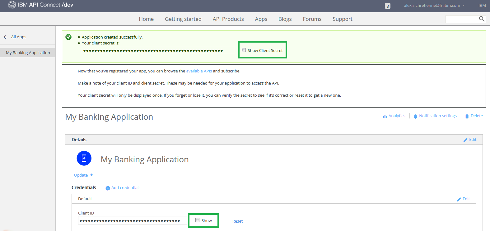

## 2.订阅银行 API 

1.	在使用银行 API 之前，您首先需要订阅它。显示可用 API 产品的列表。
	
	* 单击顶部菜单中的 **API Products**。
	* 单击列表中的 **Banking Product**。

2. 	订阅银行 API。
	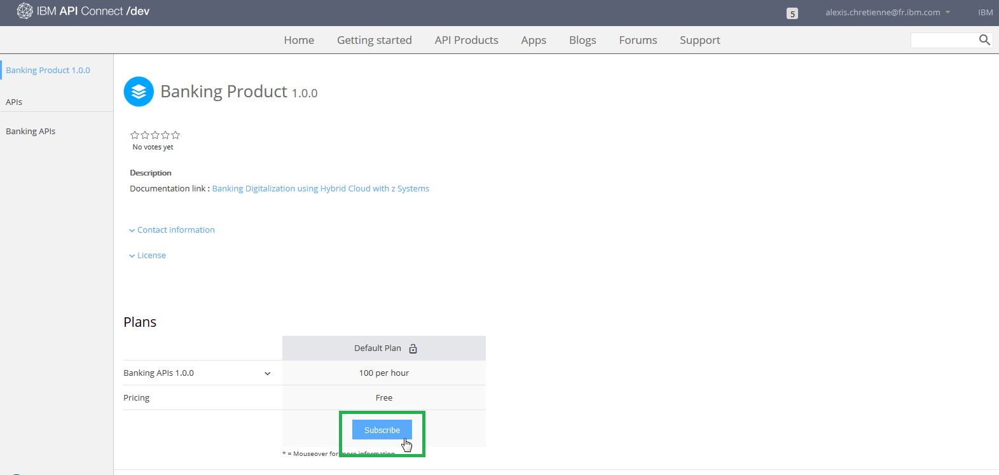
	* 单击 **Subscribe** 订阅默认计划。
	
	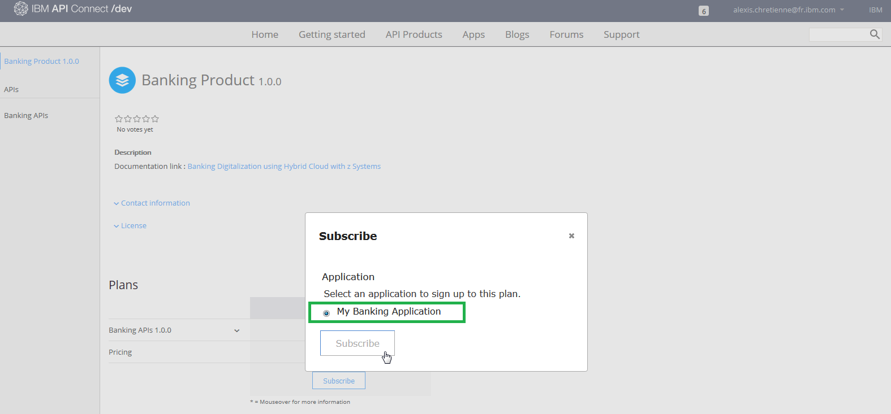
	* 选择您刚创建的应用程序。
	* 单击 **Subscribe**。
	
## 3.使用银行 API
	
1.	转到银行 API 页面。
	
	* 单击 **Banking APIs**。
	
	此页有 3 部分：
   	* 左侧面板是导航面板，列出了所有可用的操作和它们的定义。 
    * 中间面板显示您选择的项的详细信息。 
    * 右侧面板包含采用各种编程语言的示例代码。
    
2.	阅读文档以了解 **GET /customers/{customerID}** 操作。
	
	* 单击 **GET /customers/{customerID}**。
    
    此操作提供与一个银行客户相关的个人数据。这个 Github 存储库中的 */identifier/customerIDs.txt* 文件中提供了所有可用的客户 ID。
    
3.	按照 **GET /customers/{customerID}** 操作的右侧面板生成该操作的代码。
	
	* 单击您想使用的一种编程语言。
    
   	将显示所选编程语言的示例代码和一个成功响应的示例输出。您可以复制该代码并在自己的应用程序中使用它。
  
4. 	测试使用您的编程语言的 **GET /customers/{customerID}** 操作。
   	
   	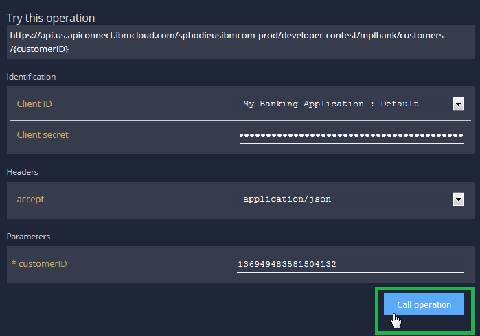
	* 下滚到 **Try this operation** 部分。
	
	> 重要事项：这个 Github 存储库中的 */identifier/customerIDs.txt* 文件中提供了所有可用的客户 ID。不要忘记在 *x-ibm-client-id* 和 *x-ibm-client-secret* 中填入您的信息。

   	* 单击 **Call Operation**。
 	
 	您应该在页面底部看到返回的输出。  	
 	
 	
 	

5.	重放此场景，以测试这个银行 API 中的所有操作。可以在 **GET /customers/{customerID}** 操作请求的 JSON 输出中找到其他操作输入参数。

---

:thumbsup: 恭喜您！您已成功发现并测试了这个银行 API。

---

# 部分 B：创建您自己的银行应用程序

我们已开发了一个快捷的银行应用程序来帮助您开始编码。这个 Web 应用程序 (HTML/CSS/Javascript) 使用了之前介绍的银行 API。 

## 1.下载并检查该银行应用程序代码

1.	下载位于 **this Github repository** 中的 *bankingApplication* 项目并导入到您最喜爱的 IDE 中，比如 Eclipse。
	
	* 单击 **Download ZIP**
	* 或使用 Git 命令： 
	>	git clone https://github.com/IBM/Banking-digitalization-using-hybrid-cloud-with-zSystem.git
	
2.	检查 *index.html* 文件，以理解它的工作原理。

3.	检查 *bankingAPI.js* 文件，以理解该脚本的工作原理。
	
	* 如果需要，更改客户 ID。这段示例代码中已硬编码了客户 ID。 
	> 备注：可以通过 this Github repository 中的 *identifier* 文件夹更改客户标识符。生成了 1000 个客户，这意味着它表示 1000 个不同的银行客户。
	* 将 **IBM_CLIENT_ID** 和 **IBM_CLIENT_SECRET** 变量替换为您的信息并保存该文件。
	
## 2.运行银行应用程序
	
1.	在最喜欢的 Web 浏览器中打开 *index.html*。该应用程序将自动运行。
	>	备注：不需要从任何 IDE 中编译 JS/HTML/CSS！只需在 IDE 中编辑这些文件，然后在 Web 浏览器中刷新 *index.html*（或按 Ctrl + F5 快捷键）来重新加载这个 Web 应用程序。 

	
	
2.	单击按钮 **Click here to load a banking customer profile**。 
	
	
	这将调用已发布的 **GET /customer/{customerID}** 操作。 
	
3. 	理解来自这个操作调用的输出 JSON 响应。

4.	调用示例银行应用程序中的其他每个服务。每个服务与一个已发布的银行操作匹配：
	* 	**Customer contract**
	*	**Banking Account - Balance Inquiry**
	*	**Banking Account - Transaction Inquiry**
	*	**Banking Account - Detail**

---

:thumbsup: 恭喜您！您已成功开发了第一个银行应用程序。

---

# 部分 C：将银行应用程序扩展到 Bluemix 中

## 1.开始使用 Node.js on Bluemix

1.	[注册或登录到 IBM Bluemix]
	
	> 备注：使用 IBM Bluemix 创建、测试和部署一个快捷应用程序。在 JAVA Liberty Profile、Node.js 服务器、Ruby、Python 等类型中选择一种。此平台还提供了用于持续交付的 DevOps 工具（Git，自动部署）和许多创新性特性和服务。

2.	转到目录并选择 **SDK for Node.js**。
	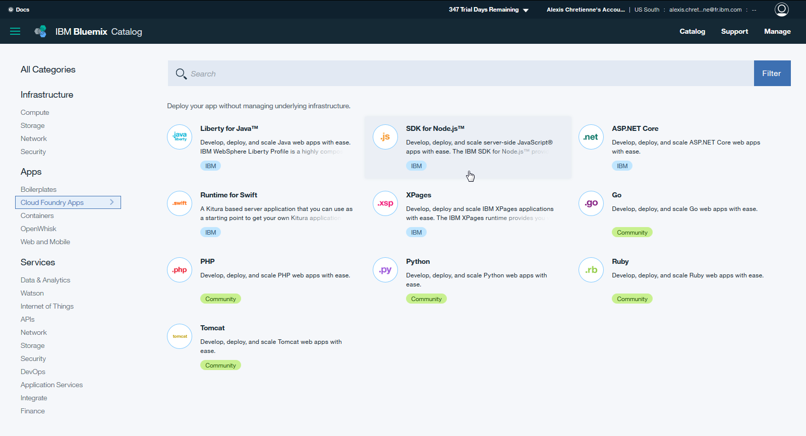

3.	免费配置您的 Node.js 项目（30 天）。
	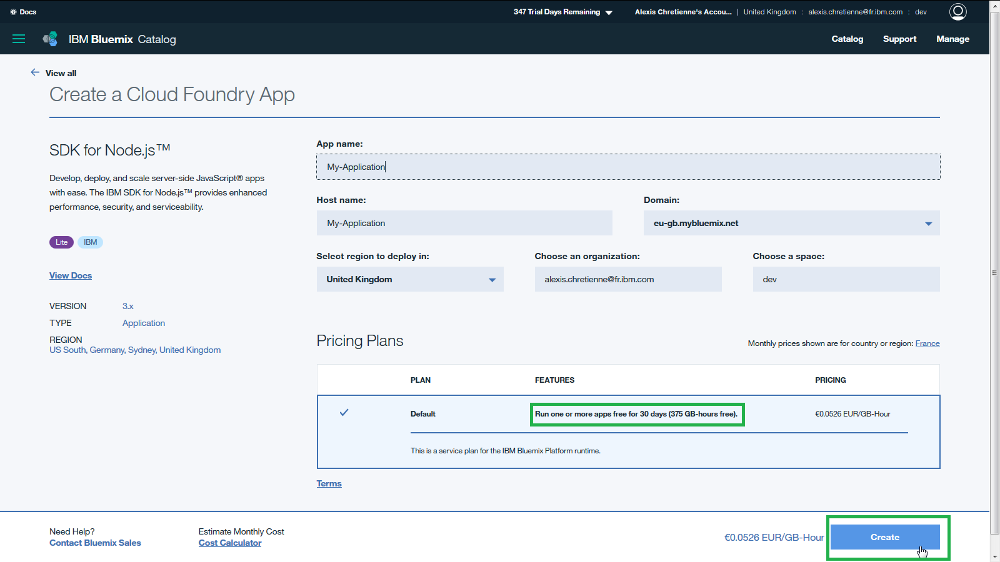
	* 提供一个应用程序名称。
	* 选择一个域。
	* 选择要将该项目部署到的地区。
	* 单击 **Create**。

4. 	等待 Node.js 运行时创建完成。

5. 	创建后，浏览此面板以熟悉它。
	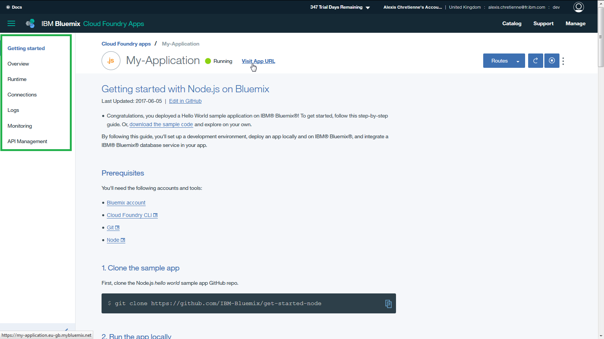
	* 单击 **Visit App URL**。已提供默认的 Node.js 项目 (Hello World)。
	* 浏览左侧面板上的每个菜单，以理解运行时、连接、日志等。
 
6.	按照 **Getting Started** 页面学习如何编辑、拉取所提供的 Hello World 应用程序并从您的计算机将它推送到 Bluemix 中的 Node.js 运行时。
	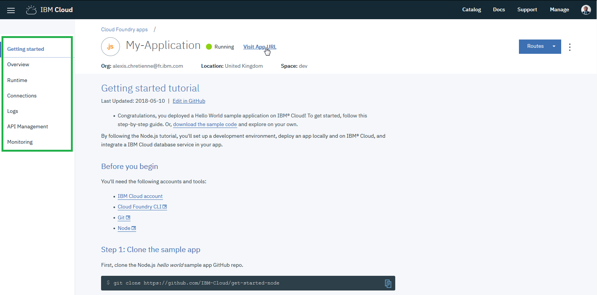
	* 阅读 **Prerequisites**。
	* 阅读 **1.克隆示例应用程序**。
	* 阅读 **2.本地运行应用程序**。
	* 阅读 **3.准备应用程序以便进行部署**。
	* 阅读 **4.部署应用程序**。

7.	在您的笔记本电脑上编辑克隆的 Hello World 示例应用程序，以集成银行应用程序文件：
	* 将 *js* 文件夹从银行应用程序复制到 *public* 文件夹中。
	* 删除 *public/stylesheets** 文件夹以删除默认 CSS 样式。
	* 将 *css* 文件夹从银行应用程序复制到 *public* 文件夹中。
	* 将 *index.html* 从银行应用程序放回到 *public* 文件夹中。
	
	
8.	使用您在第 6 步中学到的 **cf push** 命令，将新代码重新部署到 Bluemix 中的 Node.js 运行时。

9.	再次单击 Bluemix 上的 **Visit App URL**。
	

银行应用程序现在已托管在 Bluemix 中并使用了银行 API。

## 2.使用 Watson 服务创建一个认知应用程序

1.	集成 Bluemix 目录中的 [IBM Watson 服务] (API)。 
	
	* 从它们中选择一个。

2.	创建该服务。
	
	* 连接到您的现有 Node.js 项目。
	* 单击 **Create**。
	
3. 	等待所选的 Watson 服务创建完成。完成后将提示重新暂存您的 Node.js 应用程序。确认重新暂存。

4.	在您的 Node.js 应用程序中探索所选的 Watson 服务
	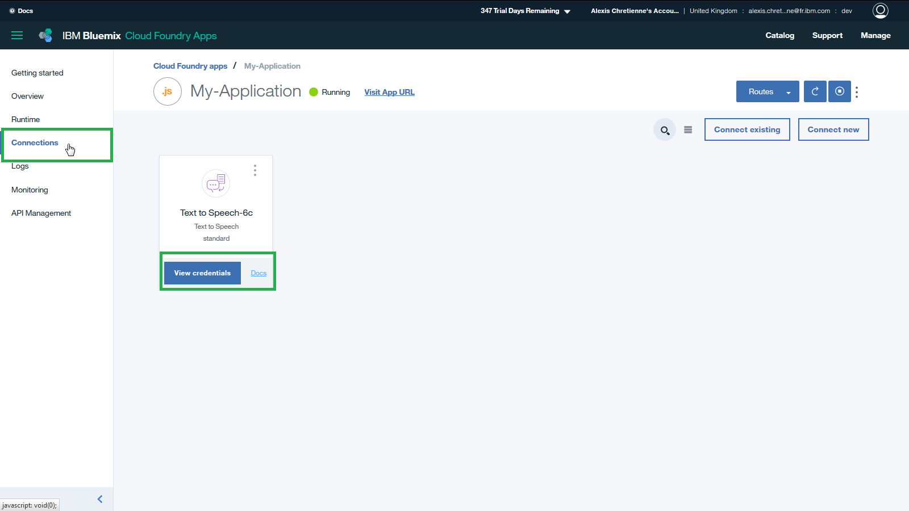
	* 单击 **Connections**。
	* 单击 **Docs**。您将学会如何通过 API 使用此服务。
	* 单击 **View Credentials**。您将拥有自己的 API 凭证。
	
5. 	使用文档和凭证，在您的 Node.js 应用程序中开发所选的 Watson 服务。

6. 	重新部署该应用程序并从 Bluemix 访问它。

---

:thumbsup: 恭喜您！您已成功在 Bluemix 中开发了第一个银行认知应用程序。

---

### 额外步骤：开始结合使用物联网和银行 API

本节将为开始使用 IoT 设备进行银行 API 编码提供一些指南。

1.	**必要条件**：引入您自己的 IoT 设备（[RASPBERRY PI]、[ARDUINO] 等）。 

2.转到 Bluemix 目录。
	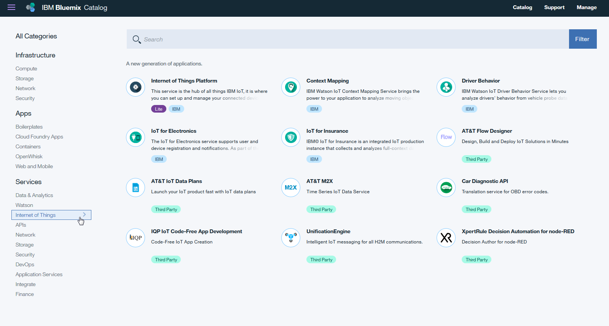
	* 选择 **Internet of Things Platform**

2.	创建该服务。
	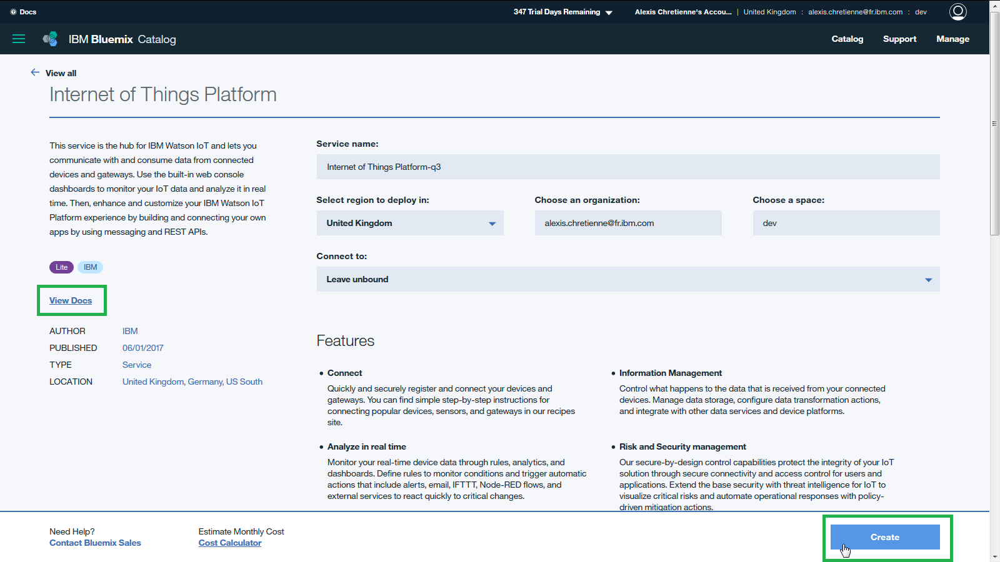
	* 提供一个服务名称。
	* 选择要部署到的地区。
	* 连接到 **Leave Unbound**。
	* 单击 **Create**。

3.	等待该 IoT 服务创建完成。

4.	探索该 IoT 服务
	
	* 单击 **Launch**。您将访问 IoT 仪表板。
	* 单击 **Docs**。您将学会如何将您的 IoT 设备连接到仪表板。
	
5. 	连接后，使用银行 API 开发对 IoT 设备的操作：
	* 想象一个传感器将触发 **GET /customers/contracts/{customerID}** 操作调用。 
	* 想象一个按钮将触发 **GET /customers/{customerID}** 操作调用。
	* 想象一个运动检测器将触发 **GET /customers/accounts{AccountID}** 操作调用。
	* 诸如此类。创新没有止境。

---

:thumbsup: 恭喜您！您已成功在 Bluemix 中开发了第一个 IoT 应用程序。

---

[IBM Bluemix]：https://www.ibm.com/us-en/marketplace/cloud-platform
[IBM Z 大型机]：https://www-03.ibm.com/systems/z/

[IBM CICS Transaction Server]：https://www-01.ibm.com/software/data/enterprise-application-servers/cics/

[IBM z/OS Connect Enterprise Edition]：https://www.ibm.com/ms-en/marketplace/connect-enterprise-edition

[IBM Db2]：https://www.ibm.com/analytics/us/en/technology/db2/?lnk=STW_US_SHP_A4_TL&lnk2=learn_DB2

[IBM API Connect]：http://www-03.ibm.com/software/products/en/api-connect

[IBM ID]：https://www.ibm.com/account/us-en/signup/register.html
[API 开发者门户]：https://developer-contest-spbodieusibmcom-prod.developer.us.apiconnect.ibmcloud.com/

[注册或登录到 IBM Bluemix]：https://console.bluemix.net/registration/?

[IBM Watson 服务]：https://www.ibm.com/cloud-computing/bluemix/watson
[IBM Internet of Things 服务]：https://www.ibm.com/cloud-computing/bluemix/internet-of-things

[MPLbank 自述文件]：https://github.com/IBM/Banking-digitalization-using-hybrid-cloud-with-zSystem/blob/master/MPLBank%20Readme.md

[RASPBERRY PI]：https://www.raspberrypi.org/
[ARDUINO]：https://www.arduino.cc/
